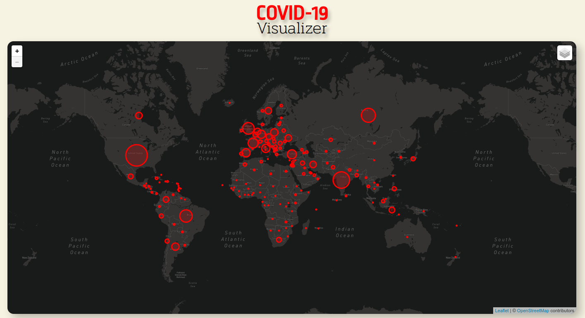

## What it is?

COVID-19 Visualizer is a simple web app made with React with the purpose of keep track and monitor the growth of COVID-19 cases across the world. You can check out the live version of the app through this link: [COVID-19 Visualizer](https://covid-19-cases-visualizer.herokuapp.com/).

As an alternative you can also run the project locally.

## Installing and running locally

To run locally you will need to install each of the below:

- [node.js](https://nodejs.org/en/) v14.17.2
- [npm](https://www.npmjs.com/) v7.19.1 or
- [yarn](https://classic.yarnpkg.com/en/docs/getting-started) v1.22.10

This project has a backend and a frontend, and you have to run both to run the project. Since this is a monorepo you can run them without having to download other repository. If you don't know how to do this, I explain in these links:

- [How to install and run the backend](backend/README.md)
- [How to install and run the frontend](frontend/README.md)

## Libs versions

### Backend libs

- [cors](https://github.com/expressjs/cors) v2.8.5
- [express](https://expressjs.com/en/starter/installing.html) v4.17.1
- [node-fetch](https://github.com/node-fetch/node-fetch) v2.6.0
- [node-schedule](https://github.com/node-schedule/node-schedule) v1.3.2

### Frontend libs

- [react](https://reactjs.org/docs/getting-started.html) v16.13.1
- [axios](https://axios-http.com/docs/intro/) v0.19.2
- [leaflet](https://leafletjs.com/examples/quick-start/) v1.6.0
- [react-leaflet](https://react-leaflet.js.org/docs/start-introduction/) v2.6.3
